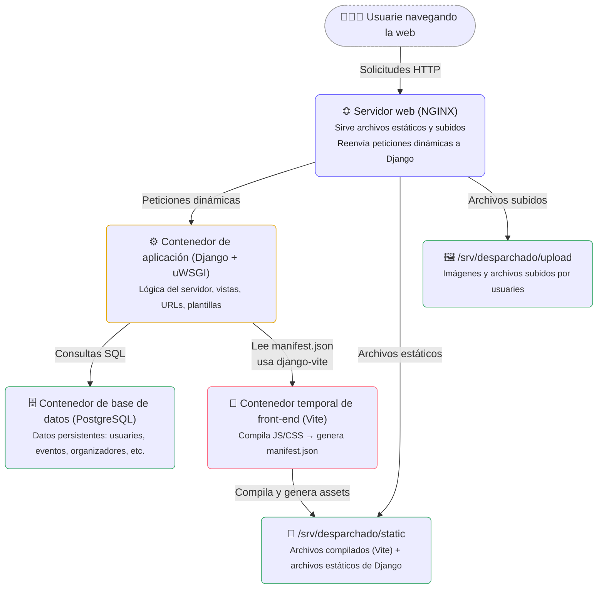

# Arquitectura de la aplicación web

Desparchado se ejecuta como una aplicación web compuesta por varios servicios en contenedores de **Docker**.

A continuación se explica cómo interactúan sus principales componentes.

## 🌐 Servidor web (NGINX)

El servidor [NGINX](https://nginx.org/) es el punto de entrada de todas las solicitudes HTTP.

* Sirve directamente los **archivos estáticos** desde `/srv/desparchado/static` (como los JavaScript y CSS compilados
  por Vite).
* También entrega los **archivos subidos por usuaries** desde `/srv/desparchado/upload` (por ejemplo, imágenes de
  eventos).
* Cualquier otra solicitud (como vistas dinámicas o peticiones de la API) se reenvía al **servidor de aplicaciones
  Django**, que corre dentro de un contenedor.

## 🐳 Contenedores

La aplicación se organiza en varios **contenedores de Docker**, cada une con una función específica:

1. Contenedor de la aplicación web ([**Django**](https://www.djangoproject.com/) + [UWSGI](https://en.wikipedia.org/wiki/UWSGI))
    * Ejecuta el servidor Django.
    * Usa **django-vite** para integrar Vite en las plantillas Django.
    * Maneja **el ruteo (URLs)**, lógica del servidor y renderiza vistas con **plantillas HTML**.
    * Se conecta al contenedor de PostgreSQL para acceder a la base de datos.
2. Contenedor de la base de datos ([**PostgreSQL**](https://www.postgresql.org/))
    * Usado exclusivamente por Django para almacenar y consultar datos persistentes (usuarios, eventos, organizadores,
      etc).
3. Contenedor temporal de front-end ([**Vite**](https://vite.dev/)):
    * Solo se ejecuta durante el **proceso de despliegue**.
    * Corre `vite build` para compilar todos los assets del front-end.
    * El resultado (archivos `.js`, `.css`, etc.) se copia a la carpeta `/srv/desparchado/static`, servida por NGINX.
    * También genera el archivo `manifest.json`, que mapea los nombres de los archivos originales con sus versiones
      compiladas y hashadas.

## ⚙️ Integración Django + Vite

Django usa la biblioteca [django-vite](https://github.com/MrBin99/django-vite) para vincular el front-end compilado con
las plantillas del back-end.

`django-vite` lee `manifest.json` para insertar correctamente los `<script>` y `<link>` en las plantillas HTML con los
nombres correctos y versionados de los archivos. Esto asegura que Django pueda servir siempre los archivos
actualizados (por ejemplo, `main-BKrA8PSi.css` en vez de main`.css`).

## 🚀 Flujo de despliegue

El despliegue de una nueva versión de Desparchado sigue el siguiente proceso:

1. Se ejecuta el contenedor temporal de Vite para compilar los assets del front-end.
2. Los archivos compilados se copian a la carpeta `/srv/desparchado/static`.
3. Se inicia el nuevo contenedor de Django.
4. Se ejecuta el comando `collectstatic`, que recopila todos los archivos estáticos (imágenes, CSS y JavaScript
   compilados por Vite) en una sola ubicación.
5. Se apaga el contenedor anterior del servidor de aplicaciones y se activa el nuevo.

El resultado es un despliegue reproducible y automatizado, en el que cada versión tiene sus propios assets estáticos.

## 🧩 Diagrama

Explicación del diagrama

* **NGINX** es el punto de entrada: recibe las solicitudes de les usuaries, entrega archivos estáticos o subidos, y
  redirige lo demás a Django.
* **Django (uWSGI)** maneja la lógica de negocio, plantillas y vistas, y se conecta a PostgreSQL para los datos.
* **Vite** se ejecuta temporalmente durante el despliegue para compilar los assets del front-end (JS, CSS, imágenes).
* Los resultados compilados se guardan en `/srv/desparchado/static`, donde NGINX puede servirlos directamente.
* Los archivos subidos por les usuaries se almacenan en `/srv/desparchado/upload`.
